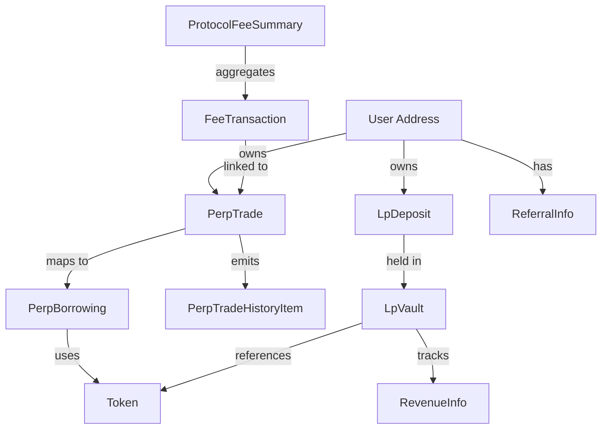

# Sai Keeper GraphQL Reference

This document provides a deep dive into the GraphQL schema of Sai Keeper, including detailed descriptions of enums, types, and the underlying contract logic that drives them.

## 1. Enum Catalog

### PerpTradeChangeType
Emitted during various stages of a trade's lifecycle:
- `position_opened`: Emitted when a market order is successfully executed.
- `limit_order_created`: A limit order is placed on the books.
- `stop_order_created`: A stop order is placed on the books.
- `order_triggered`: A limit or stop order has been hit and executed.
- `position_closed_tp`: Closed via Take Profit trigger.
- `position_closed_sl`: Closed via Stop Loss trigger.
- `position_liquidated`: Forced closure due to insufficient margin.
- `position_closed_user`: User manually closed the position.
- `order_closed_user`: User manually cancelled a pending order.
- `tp_updated` / `sl_updated`: User modified trigger prices.

### FeeType
Categorizes the timing of fee collection:
- `OPENING`: Fees paid when entering a position.
- `CLOSING`: Fees paid when exiting a position.

### TokenType
Defines the source of the asset:
- `bank`: Native Cosmos SDK coin (e.g., `unibi`).
- `erc20`: Token residing on the Nibiru EVM (e.g., bridged USDC).

### Order Enums (Sorting)
Common keys for `order_by` parameters:
- `sequence`: Global monotonically increasing event index.
- `trade_id`: The ID assigned to a specific trade.
- `id`: Primary key of the record.
- `name`: Alphabetical sorting for tokens.
- `depositor` / `vault`: Sorting for LP-related lists.

---

## 2. Advanced Accounting: LP Domain

The `lp` domain queries reflect the state of the Sai SLP vaults. Key variables from the accounting model:

### Share Pricing
- **`ψ` (share_to_assets_price)**: The conversion rate from shares to assets.
  - Formula: `ψ = 1 + ρ − max(0, π_used)`
- **`ρ` (acc_rewards_per_token)**: Cumulative rewards earned by LPs per share.
- **`π` and `π_used` (acc_pnl_per_token)**: Realized and unrealized PnL from traders, scaled per share.

### Withdrawal Timelocks
Withdrawals are subject to epochs and timelocks based on collateralization (`collat_p`):
- **1 Epoch**: Standard delay when vault is well-collateralized.
- **2-3 Epochs**: Extended delay when the vault is under-collateralized or has high liabilities.
- **Epoch Length**: Standard is 72 hours (48h open for requests, 24h locked for settlement).

---

## 3. Market Dynamics: Perp Domain

### Borrowing Mechanism
Borrowing fees (funding rates) are calculated per block based on Open Interest (OI) imbalance:
- **Net OI**: `|OI Long - OI Short|`.
- **Fee Sensitivity**: Driven by a `fee_exponent` (usually 1.0 to 3.0). Higher exponent means fees increase faster as imbalance grows.
- **Borrowing Groups**: Multiple markets (e.g., BTC/USD, ETH/USD) can be grouped to share a single `oiMax` limit and borrowing rate parameters.

### Liquidation Logic
Positions are liquidated when the `remainingCollateralAfterFees` drops below the maintenance margin.
- **`liquidationPrice`**: Calculated including the estimated `borrowingFeeCollateral` and `closingFeeCollateral`.

---

## 4. Fee Structure and Tiers

Sai implements a tiered fee system based on trading "points" (usually 1:1 with volume):

| Tier | Points Threshold | Multiplier |
|------|------------------|------------|
| 0    | 6,000,000        | 0.975      |
| 1    | 20,000,000       | 0.950      |
| 2    | 50,000,000       | 0.925      |
| ...  | ...              | ...        |
| 7    | 2,000,000,000    | 0.600      |

- **Governance Split**: Collected fees are split between the **LP Vault** (~80-90%) and **Governance** (~10-20%).
- **Trigger Fees**: A portion of the closing fee is awarded to the keeper that triggers a TP/SL/Liquidation.

---

## 5. Units and Precision

- **Base Units**: All numeric amounts (e.g., `collateralAmount`, `tvl`) are integers in the token's base units.
  - *Example*: USDC has 6 decimals, so `1,000,000` = $1.00.
- **Decimal Strings**: GraphQL returns `Decimal` types as strings (e.g., `"0.95"`) to preserve precision that standard JSON floats might lose.
- **Float types**: Fields like `pnlPct` or `priceUsd` are native GraphQL Floats.

---

## 6. Type Relationship Map



---

## 7. Subscription Payloads

### `userBalances`
Returns an array of `Balance` objects:
```json
{
  "amount": "10000000",
  "token_info": {
    "symbol": "USDC",
    "decimals": 6,
    "type": "erc20",
    "bank_denom": "erc20/0x...",
    "erc20_contract_address": "0x..."
  }
}
```

### `perpTrades`
Returns the updated `PerpTrade` object including the real-time `PerpTradeState`:
```json
{
  "id": 123,
  "isOpen": true,
  "state": {
    "pnlPct": 0.05,
    "positionValue": 10500000,
    "liquidationPrice": 42500.5
  }
}
```
