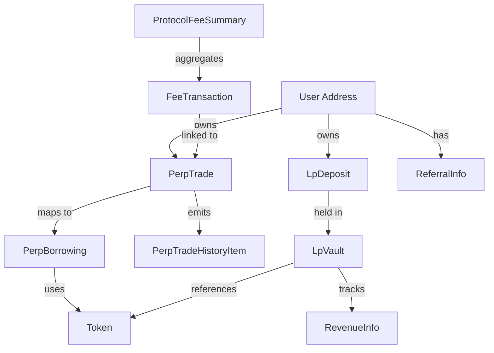

# Sai Keeper GraphQL queries

Use this reference for Sai Keeper GraphQL queries about indexed perp trades, LP
activity, oracle prices, fees, referral history, subscriptions, and app-facing
entities. Read [`sai-db.md`](sai-db.md) when resolving indexer semantics,
freshness, or source data.

## GraphQL query guide

## Quick facts

- **sai-keeper** = Sai exchange GraphQL API. Source schema lives in `$HOME/ki/sai-keeper/graphql/graph/*.graphqls`.
- **HTTP endpoint**: Root path is `/query` (e.g. `https://sai-keeper.nibiru.fi/query`).
- **Endpoint Discrepancy**: Public/proxy deployments may use `/graphql` for HTTP and WS. Always verify the actual deployment path.
- **Playground**: Root URLs `https://sai-keeper.nibiru.fi/` and `https://sai-keeper.testnet-2.nibiru.fi/`.
- **WebSocket**: Same host with path `/query`; e.g. `wss://sai-keeper.nibiru.fi/query`.

## Environments

| Environment | HTTP (GraphQL) | Playground | WebSocket |
|-------------|----------------|------------|-----------|
| Mainnet | `https://sai-keeper.nibiru.fi/query` | `https://sai-keeper.nibiru.fi/` | `wss://sai-keeper.nibiru.fi/query` |
| Testnet | `https://sai-keeper.testnet-2.nibiru.fi/query` | `https://sai-keeper.testnet-2.nibiru.fi/` | `wss://sai-keeper.testnet-2.nibiru.fi/query` |

## Core concepts

- **Sai Protocol**: Decentralized perpetual futures exchange on Nibiru Chain.
- **Contract Stack**: 5 Wasm contracts: Perp Manager, LP Vault, Oracle, Fee Manager, and Governance.
- **Data Domains**:
  - `perp`: Perpetual trading positions, history, and borrowing rates.
  - `lp`: Liquidity pool metrics, user deposits, and withdrawal requests.
  - `oracle`: Real-time and historical token prices.
  - `fee`: Fee transactions, daily statistics, and protocol revenue analytics.
- **Key Terms**:
  - **Collateral**: Assets used as margin for trades.
  - **Liquidation**: Forced closure of positions with insufficient margin.
  - **Borrowing Fees**: Sai's mechanism for balancing markets (funding rate).
  - **Epoch**: Time period for LP operations (deposits/withdrawals).
  - **TVL**: Total Value Locked in a vault (available assets + open position assets).

## Amount and type semantics

- **Amounts**: Numeric values like `collateralAmount` or `tvl` are `Int` in base units (e.g., 6 decimals for USDC/stNIBI).
- **Percentages/Prices**: Use `Float` (e.g., `pnlPct`, `priceUsd`, `sharePrice`).
- **Time**: Represented by the `Time` scalar (RFC3339 format).
- **Token Decimals**: `Token` (from Oracle) does not expose `decimals`. Use `TokenInfo` (in `Balance` via `userBalances` subscription) to get decimal metadata.

## Root types and API reference

### Perp

- **trade(trader, id)**: Get a specific trade.
- **trades(where!)**: List trades for a trader. `PerpTradesFilter` requires `trader`.
- **tradeHistory**: Detailed event log of trade modifications (opens, closes, liquidations, order triggers).
- **borrowing(marketId, collateralId)**: Get detailed market metrics.
- **borrowings**: List available markets.
- **referralInfo(userAddress)**: Get referral redemption details for a user.
- **referralCodes(owner)**: List referral codes owned by an address.
- **referralRedemption(user)**: Check if a user has redeemed a code.

**PerpTradeChangeType**: `position_opened`, `position_closed_user`, `position_closed_tp`, `position_closed_sl`, `position_liquidated`, `limit_order_created`, `stop_order_created`, `order_triggered`, `order_closed_user`, `tp_updated`, `sl_updated`.

### LP (liquidity provision)

- **vaults**: Metrics for SLP vaults (single-collateral model).
- **deposits**: Active LP positions for a user.
- **depositHistory**: Historical deposit and withdrawal events.
- **withdrawRequests**: Pending withdrawal requests with `unlockEpoch`.
- **RevenueInfo**: Tracks `NetProfit`, `TraderLosses`, `ClosedPnl`, `Liabilities`, and `CurrentEpochPositiveOpenPnl`.

### Oracle

- **tokens**: List metadata for all supported assets.
- **token(id)**: Specific asset metadata.
- **tokenPricesUsd**: Current market prices. Always check `lastUpdatedBlock` for freshness (warn if > 60s old).

### Fee

- **feeTransactions**: Detailed breakdown of every fee paid.
- **feeDailyStats**: Aggregated daily data by collateral and trader.
- **feeAnalytics**: Enhanced statistics including `avgFeeMultiplier`.
- **traderFeeSummary** / **protocolFeeSummary**: Aggregated revenue over time periods.

## Filters and pagination

Common parameters across most list fields:

- **where**: Filter object (e.g., `trader`, `perpMarketId`, `isOpen`, `depositor`, `vault`).
- **order_by**: Domain-specific sorting (e.g., `sequence`, `trade_id`, `id`, `name`).
- **order_desc**: Boolean for descending order.
- **limit** / **offset**: Standard pagination (default limits apply).

**Filter Types**:
- `StringFilter`: `{ eq, like }`
- `IntFilter`: `{ eq, gt, gte, lt, lte }`
- `TimeFilter`: `{ eq, gt, gte, lt, lte }`

## Subscriptions

Real-time updates via WebSocket (`wss://`).

| Subscription | Filter (`where`) | Notes |
|--------------|------------------|-------|
| `tokenPricesUsd` | optional `SubTokenPriceUsdFilter` | Price feed for all or specific token. |
| `perpTrades` | `SubPerpTradesFilter!` | Real-time position updates for a trader. |
| `perpTradeHistory` | `SubPerpTradeHistoryFilter!` | Trade event updates for a trader. |
| `perpBorrowing` | `marketId!, collateralId!` | Single market borrowing rate updates. |
| `perpBorrowings` | none | All market availability updates. |
| `lpVaults` | none | Live TVL and APY updates for all vaults. |
| `lpDeposits` | `SubLpDepositsFilter!` | User LP share balance updates. |
| `lpDepositHistory` | `SubLpDepositHistoryFilter!` | Real-time deposit/withdrawal events. |
| `lpWithdrawRequests` | `SubLpWithdrawRequestsFilter!` | Withdrawal status updates. |
| `userBalances` | `SubUserBalancesFilter!` | Live wallet balance updates for all assets. Includes `TokenInfo` with `decimals`. |

## REST API

When running `sai-keeper` with the `-api` flag:

- **GET /api/stats**: Exchange statistics (JSON). Includes `trading_volume_24h`, `total_trades_24h`, `open_interest`, `tvl`, and `accrued_trading_fees_24h`.
- **GET /health**: Service health status.
- **GET /**: API overview and available endpoints.

## Calculations and formulas

- **Position Value**: `Collateral Amount * Leverage` (USD if collateral price is known).
- **Borrowing APR**: `feesPerHour * 24 * 365 * 100`.
- **Deposit Value**: `(shares * sharePrice) / 10^decimals`.
- **APY**: `(NetProfit / TVL) * (365 / epochDurationDays) * 100`.
- **Liquidation (Long)**: `Entry Price * (1 - 1/Leverage + maintenance_margin)`.
- **Liquidation (Short)**: `Entry Price * (1 + 1/Leverage - maintenance_margin)`.
- **Fee**: `Total Fee = Vault Fee + Gov Fee + Trigger Fee`.
- **Dynamic Fee**: `Actual Fee = Base Fee * feeMultiplier`.

## Related repositories and sources

- **sai-keeper** (`$HOME/ki/sai-keeper`): GraphQL schema and backend implementation.
- **sai-docs** (`$HOME/ki/sai-docs`): 
  - API References: `dev/sai-keeper/api-*.md`
  - Core Concepts: `dev/sai-keeper/core-concepts.md`
  - Deployment/Setup: `dev/sai-keeper/README.md`
- **sai-perps** (`$HOME/ki/sai-perps`): Core protocol logic (Borrowing, Fees).
- **sai-website/webapp**: Web frontend; reference for query implementation.

## Additional documentation

For GraphQL enums, accounting variables, fee tiers, and entity relationships,
continue to [schema and accounting reference](#schema-and-accounting-reference).


---

## Schema and accounting reference

This document provides a deep dive into the GraphQL schema of Sai Keeper, including detailed descriptions of enums, types, and the underlying contract logic that drives them.

### Enum catalog

#### `PerpTradeChangeType`
Emitted during various stages of a trade's lifecycle:
- `position_opened`: Emitted when a market order is successfully executed.
- `limit_order_created`: A limit order is placed on the books.
- `stop_order_created`: A stop order is placed on the books.
- `order_triggered`: A limit or stop order has been hit and executed.
- `position_closed_tp`: Closed via Take Profit trigger.
- `position_closed_sl`: Closed via Stop Loss trigger.
- `position_liquidated`: Forced closure due to insufficient margin.
- `position_closed_user`: User manually closed the position.
- `order_closed_user`: User manually cancelled a pending order.
- `tp_updated` / `sl_updated`: User modified trigger prices.

#### `FeeType`
Categorizes the timing of fee collection:
- `OPENING`: Fees paid when entering a position.
- `CLOSING`: Fees paid when exiting a position.

#### `TokenType`
Defines the source of the asset:
- `bank`: Native Cosmos SDK coin (e.g., `unibi`).
- `erc20`: Token residing on the Nibiru EVM (e.g., bridged USDC).

#### Order enums (sorting)
Common keys for `order_by` parameters:
- `sequence`: Global monotonically increasing event index.
- `trade_id`: The ID assigned to a specific trade.
- `id`: Primary key of the record.
- `name`: Alphabetical sorting for tokens.
- `depositor` / `vault`: Sorting for LP-related lists.

---

### Advanced accounting: LP domain

The `lp` domain queries reflect the state of the Sai SLP vaults. Key variables from the accounting model:

#### Share pricing
- **`ψ` (share_to_assets_price)**: The conversion rate from shares to assets.
  - Formula: `ψ = 1 + ρ − max(0, π_used)`
- **`ρ` (acc_rewards_per_token)**: Cumulative rewards earned by LPs per share.
- **`π` and `π_used` (acc_pnl_per_token)**: Realized and unrealized PnL from traders, scaled per share.

#### Withdrawal timelocks
Withdrawals are subject to epochs and timelocks based on collateralization (`collat_p`):
- **1 Epoch**: Standard delay when vault is well-collateralized.
- **2-3 Epochs**: Extended delay when the vault is under-collateralized or has high liabilities.
- **Epoch Length**: Standard is 72 hours (48h open for requests, 24h locked for settlement).

---

### Market dynamics: Perp domain

#### Borrowing mechanism
Borrowing fees (funding rates) are calculated per block based on Open Interest (OI) imbalance:
- **Net OI**: `|OI Long - OI Short|`.
- **Fee Sensitivity**: Driven by a `fee_exponent` (usually 1.0 to 3.0). Higher exponent means fees increase faster as imbalance grows.
- **Borrowing Groups**: Multiple markets (e.g., BTC/USD, ETH/USD) can be grouped to share a single `oiMax` limit and borrowing rate parameters.

#### Liquidation logic
Positions are liquidated when the `remainingCollateralAfterFees` drops below the maintenance margin.
- **`liquidationPrice`**: Calculated including the estimated `borrowingFeeCollateral` and `closingFeeCollateral`.

---

### Fee structure and tiers

Sai implements a tiered fee system based on trading "points" (usually 1:1 with volume):

| Tier | Points Threshold | Multiplier |
|------|------------------|------------|
| 0    | 6,000,000        | 0.975      |
| 1    | 20,000,000       | 0.950      |
| 2    | 50,000,000       | 0.925      |
| ...  | ...              | ...        |
| 7    | 2,000,000,000    | 0.600      |

- **Governance Split**: Collected fees are split between the **LP Vault** (~80-90%) and **Governance** (~10-20%).
- **Trigger Fees**: A portion of the closing fee is awarded to the keeper that triggers a TP/SL/Liquidation.

---

### Units and precision

- **Base Units**: All numeric amounts (e.g., `collateralAmount`, `tvl`) are integers in the token's base units.
  - *Example*: USDC has 6 decimals, so `1,000,000` = $1.00.
- **Decimal Strings**: GraphQL returns `Decimal` types as strings (e.g., `"0.95"`) to preserve precision that standard JSON floats might lose.
- **Float types**: Fields like `pnlPct` or `priceUsd` are native GraphQL Floats.

---

### Type relationship map



---

### Subscription payloads

#### `userBalances`
Returns an array of `Balance` objects:
```json
{
  "amount": "10000000",
  "token_info": {
    "symbol": "USDC",
    "decimals": 6,
    "type": "erc20",
    "bank_denom": "erc20/0x...",
    "erc20_contract_address": "0x..."
  }
}
```

#### `perpTrades`
Returns the updated `PerpTrade` object including the real-time `PerpTradeState`:
```json
{
  "id": 123,
  "isOpen": true,
  "state": {
    "pnlPct": 0.05,
    "positionValue": 10500000,
    "liquidationPrice": 42500.5
  }
}
```
